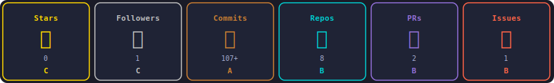

---

## About Me

Full-Stack Developer based in Thailand. I build scalable web platforms, game server infrastructure, and developer tooling — primarily around the **FiveM/RedM** ecosystem and **game topup platforms**.

- Building a game top-up platform supporting 500+ games
- Developing a FiveM launcher with anti-cheat and script marketplace
- Working on high-concurrency backend systems and microservices
- Contact: **mali2002@devilhunter-fivem.xyz**

---

## Connect

---

## Tech Stack

**Languages**

**Frameworks & Libraries**

**Database & Infrastructure**

**Game Development**

---

## GitHub Stats

---

## Trophies

---

## Contribution Graph

---

